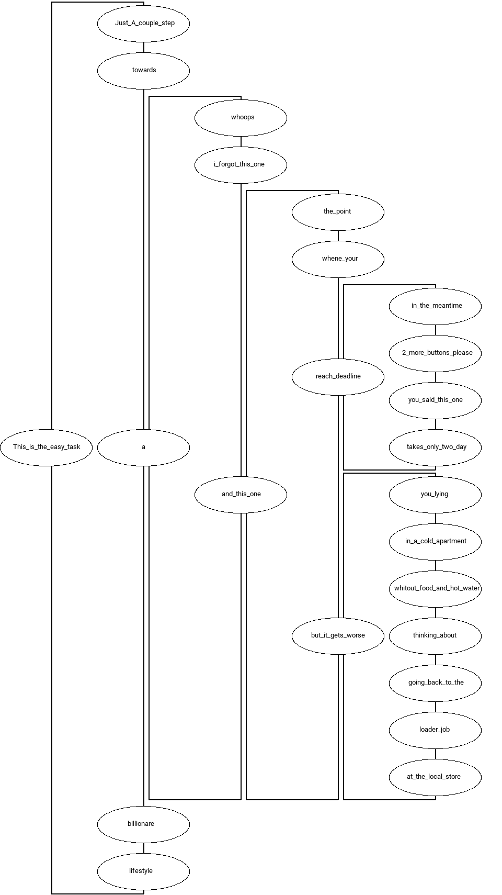

# Coallo - specification on the tiny scale

"I'll work out in detail when I will code it" - Every beginner before the huge defeat.

Work it out in details before code! Writing down helps understand your task.
**Coallo** can visualize it for you.

Example usage:

```
python3 main.py <path-to-md>
```

## Syntax

3 kinds of elements:
 - ``` ## ```  root element
 - ``` ### ``` branch element
 - ``` - ```   list element


Root element:
```
## i_am_root the rest is ignored in the line
 - damn_its_md
```

Branches/tasks broken into parts:
```
### damn_its_md
 - step1
 - step2
```
Branches olny visualized if exists as a child in the tree with the Heading2 root

Multiple root elements can exists!


```
## This_is_the_easy_task
 - Just_A_couple_step
 - towards
 - a
 - billionare
 - lifestyle

### a
 - whoops
 - i_forgot_this_one
 - and_this_one

### and_this_one
 - the_point
 - whene_your
 - reach_deadline
 - but_it_gets_worse

###reach_deadline
 - in_the_meantime
 - 2_more_buttons_please
 - you_said_this_one
 - takes_only_two_day

### but_it_gets_worse
 - you_lying
 - in_a_cold_apartment
 - whitout_food_and_hot_water
 - thinking_about
 - going_back_to_the
 - loader_job
 - at_the_local_store

```




Estimation is hard! Do it whit caution!
Details are everything, you write your programe line by line,
not funciton after fuction.
